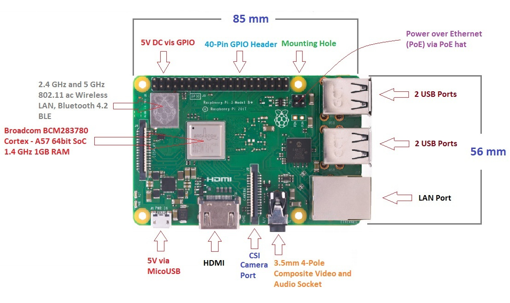

---
hide:
  - navigation
  - toc
  - footer
---

# Raspberry Pi

Un semplice corso per parlare di:

- **Raspberry Pi**: un computer delle dimensioni di una carta di credito

- **Internet of Things**: la *moda* elettronica del momento. Del presente... e del futuro!!!

- **Thonny**: il nostro editor Python preferito!!! Python c'entra sempre...

- **OpenCV**: Una libreria utile per l'elaborazione al computer delle immagini e dei video in tempo reale.

Poi... per il divertimento di tutti, allestiremo anche una sezione di tutorials, per (provare a) fare cose in autonomia!!

Cominciamo!

<a href="rpi/00_intro/" class="md-button md-button--primary" style="width:230px">Raspberry Pi</a>
&nbsp;&nbsp;&nbsp;
<a href="sensori/00_intro/" class="md-button" style="width:230px">Sensori e RPi</a>
&nbsp;&nbsp;&nbsp;
<a href="opencv/00_intro/" class="md-button" style="width:230px">OpenCV</a>

 
 
 

