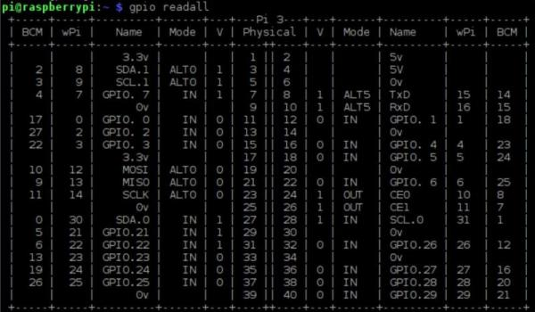

# GPIO

Qualsiasi esperienza che si vuole effettuare collegando un raspberry ad
uno o più sensori non può prescindere dalla conoscenza dell\'interfaccia
hardware predefinita per l\'input/output: il **General Purpose Input
Output, GPIO**.

Tanto per essere sicuri che ci capiamo, quello fatto come in figura\...

{.align-center}

Prendete anche un RPI in mano e guardate bene per capire: il GPIO non è
altro che la sequenza di PIN, di cui molti funzionano sia per l\'input
delle informazioni che per l\'output delle stesse, a cui è possibile
collegare praticamente ogni sorta di sensore, analogico o digitale,
adatto più o meno a qualunque scopo. Da tutto questo ragionamento si
spiega anche la scelta del nome: General Purpose Input Output.

Per gestire questi pin, bisogna prima riconoscerli\... e qui nascono le
prime difficoltà! Infatti, a seconda dell\'interfaccia utilizzata per
gestirli abbiamo 3 diversi modi per numerarli:

1.  GPIO numbering
2.  Physical numbering
3.  WiringPi numbering

## GPIO numbering

Questo sistema di numerazione dei pin è stato stabilito dal produttore
dell\'interfaccia hardware, ovvero dei pin stessi e del chipset che li
controlla. Per chi è interessato alla cosa, il controller è un Broadcom
BCM2835/BCM2836/BCM2837 :)

Inutile spiegare tanto a parole quando si può semplicemente guardare
un\'immagine e dire *vabbè\...*

{.align-center}

## Physical numbering

Un altro modo di contare i pin è quello di numerarli a due a due a
partire da in alto a sinistra (il numero 1 è il pin più vicino allo slot
della scheda MicroSD)

Anche qui, con un\'immagine è più semplice:

{.align-center}

## WiringPi numbering

Ultimo metodo per \"contare\" i pin è quello basato sulla libreria
*WiringPi*. L\'immagine che segue è presa dal sito WiringPi e confronta
i tre metodi di numerazione dei pin

{.align-center}

Un metodo ulteriore per controllare i numeri dei pin del raspberry è
quello di interrogare direttamente il gpio tramite un piccolo
applicativo contenuto nelle librerie WiringPi.

``` bash
$ gpio readall
```

L\'output di questo comando dovrebbe essere una cosa del genere:

{.align-center}

Leggendo attentamente lo schema riportato possiamo desumere tutte le
informazioni necessarie :)
