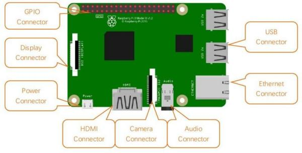

# Raspberry PI

Raspberry Pi (da ora in poi mi riferirò ad esso chiamandolo semplicemente *Raspberry*, oppure con la sigla RPI)
è un microcomputer delle dimensioni di una carta di credito.
Progettato dalla *Raspberry PI Foundation*, la sua prima release è avvenuta nel 2012 e rappresenta uno
dei migliori esempi di applicazione dei modelli di business promossi da
[Hardware libero](https://it.wikipedia.org/wiki/Hardware_libero) e
[Software libero](https://it.wikipedia.org/wiki/Software_libero) insieme.

!!! tip "Siti di riferimento"
    Il sito della `Raspberry Pi Foundation` è <a href="https://www.raspberrypi.org/" target="_blank">https://www.raspberrypi.org/</a>.
    Qui potete trovare tutte le informazioni *sociali* a riguardo: documentazione, progetti, tutorial, iniziative, etc...

    Il sito *commerciale* è invece <a href="https://www.raspberrypi.com/" target="_blank">https://www.raspberrypi.com/</a>.
    Qui troverete informazioni sulla produzione e l'utilizzo dei Raspberry nel mondo, potrete acquistarne uno o scaricare il software per farlo
    funzionare.

Viene ampiamente utilizzato per l'implementazione di migliaia di
progetti che includono workstation desktop a basso costo, media center,
smart home, robot, server tascabili, sensoristica,
prototyping, ecc. E per tutto quello che viene definito `IoT`, **Internet of Things**.

Il sistema operativo ufficiale si chiama `Raspberry Pi OS`, è basato su Linux e trovate sul sito commerciale ogni informazione su download, installazione,
primo utilizzo. In alternativa, è possibile eseguire su id esso una versione specifica di Windows,
chiamata [Windows for IoT](https://developer.microsoft.com/en-us/windows/iot).

Contiene diverse interfacce hardware di utilizzo comune:

-   USB.
-   ethernet (rete cablata).
-   HDMI.
-   fotocamera.
-   audio (jack da 3.5mm, quello delle cuffie).
-   display
-   GPIO (un'interfaccia generica a cui collegare qualsiasi sensore).
-   Wifi e Bluetooth onboard

Il mondo Finora, Raspberry Pi si è sviluppato fino alla quarta generazione. Le
modifiche nelle versioni sono accompagnate da aumenti e aggiornamenti
dell\'hardware. Fortunatamente dalla versione 2 in avanti le interfacce
e la GPIO si sono uniformati, in modo che qualsiasi progetto possa
essere eseguito più o meno allo stesso modo in qualunque delle ultime
versioni.

A scuola abbiamo una serie di `RPI versione 3, modello B+`,
modello a cui si riferisce la figura precedente. La nostra trattazione
da qui in avanti si rivolgerà esplicitamente a questo tipo di RPI.
Sappiate comunque che con modifiche minime (e spesso nessuna) quello che
vediamo può essere replicato in molte altre versioni di RPI.

Iniziamo!!

 
 
 
