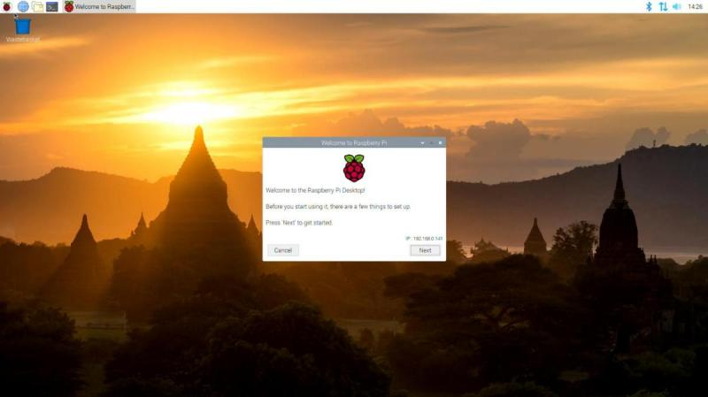

# Installazione

Per installare un qualsiasi sistema operativo su RPI abbiamo bisogno
delle seguenti cose:

-   un RPI :)
-   un sistema operativo :))
-   Una card MicroSD (farà da Hard Disk al raspberry)
-   un adattatore USB oppure SD per scrivere sulla MicroSD (dipende se
    il vostro PC ha un lettore SD o solo porte USB)
-   un cavo MicroUSB per alimentare il raspberry

A proposito di alimentazione del raspberry, ecco una tabella riassuntiva
di quanto questi piccoli dispositivi necessitano a livello energetico

  Prodotto        | Corrente  | Assorbimento Massimo  | Consumo tipico
  ----------------|-----------|-----------------------|----------------
  RPI 3 Model B   | 2.5A      | 1.2A                  | 400mA
  RPI 3 Model B+  | 2.5A      | 1.2A                  | 500mA
  RPI 4 Model B   | 3.0A      | 1.2A                  | 600mA
  RPI Zero W      | 1.2A      | (limitato)            | 150mA

Se vogliamo fare proprio i precisoni, fra il materiale necessario
bisogna elencare anche:

-   Un monitor con ingresso HDMI (oppure VGA con adattatore HDMI)
-   un mouse e una tastiera con uscite USB
-   Un cavo ethernet per il collegamento alla rete (senza WIFI)

La procedura che segue mostrerà come installare `Raspberry Pi OS`, il sistema
operativo basato su Debian Linux e ottimizzato per raspberry.

A partire dal link: <https://www.raspberrypi.com/software/>, tramite il **Raspberry Pi Imager**
saranno proposte varie opzioni di download, tra cui:

1.  with desktop and recommended software
2.  with desktop
3.  lite

Io consiglio sempre di scaricare e installare la seconda (quella con il
solo desktop), perché avere l'interfaccia grafica è un bel vantaggio
per molti (la versione lite ha solo interfaccia testuale) ma il software
*raccomandato* consiste in parecchi GB di software
potenzialmente inutile ai nostri scopi.

Selezionata la scheda (Micro)SD di riferimento, la versione del sistema operativo richiesta,
la versione del Raspberry che dovrà eseguirlo, si fa partire il processo e ... si aspetta.

Fatta la copia del sistema operativo sulla scheda MicroSD, inseritela
nel raspberry, collegate tutto ciò che serve (mouse, tastiera, monitor,
rete) e per ultimo l'alimentazione.

!!! warning "il raspberry non ha un tasto di accensione!"
    Il collegamento alla corrente deve essere quindi l'ultima cosa da fare
    quando si prepara un Raspberry per l'accensione.

| Ecco fatto!
| Buon Raspberry a tutti!

!!! tip "Suggerimento"
    Il sistema operativo Raspberry propone di default il seguente utente.

    **USER: pi** 
    **PASS: raspberry** 

    Nella versione desktop comunque, l'utente ha l'accesso automatico
    abilitato (senza digitare la password), quindi nella realtà all'inizio
    questa informazione non serve. Per qualsiasi operazione
    *amministrativa* però, sarà richiesta l'autenticazione!
