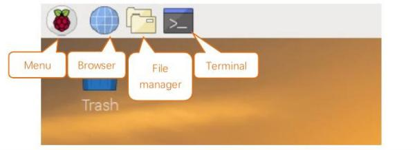
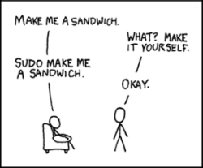

# Operazioni di base

Ripartiamo dal Raspberry come lo abbiamo lasciato un attimo fa: acceso,
pronto (caricamento iniziale finito), con interfaccia grafica

{.align-center}

Ricordo inoltre le credenziali dell\'account di default.

| **USER: pi**
| **PASS: raspberry**

Il tool che ci viene presentato davanti serve per la configurazione
iniziale. Mi raccomando di **non** cambiare la password dell\'utente
*pi* a meno che non siate assolutamente sicuri di ricordarvela. In caso
siate senza interfaccia grafica, oppure vogliate procedere con la buona
vecchia riga di comando, chiudete quella finestra e leggetevi il
prossimo capitolo.

## Configurazione Raspberry

Il sistema operativo Rasbian fornisce un tool a linea di testo da cui
accedere a tutte le configurazioni di base del Raspberry. Per accedere
ad esso si dovrà utilizzare il comando sudo.

``` bash
$ sudo raspi-config
```

A quel punto si avrà accesso ad una interfaccia *grafica-testuale* con
cui completare la configurazione:

{.align-center}

Le opzioni sono in ordine e si può procedere tramite esse a configurare
il Raspberry. Alcune opzioni sono chiarissime e non necessitano di
spiegazioni; ad esempio quella di cambiare password :)

Mi dedico a quelle che di solito servono:

Network Options

:   Le opzioni che trovate qui servono per impostare la rete. Sono cose
    che potete fare tranquillamente anche tramite l\'interfaccia
    grafica, se la utilizzate.

    L\'opzione importante da settare all\'inizio riguarda però
    l\'hostname, il nome del vostro Raspberry! Tramite quello sarà più
    facile identificarlo nella rete! Per applicare questa impostazione
    serve di riavviare il Raspberry. Potete farlo anche alla fine di
    tutta la configurazione ;)

Localisation Options

:   Queste opzioni servono per la localizzazione: tastiera italiana,
    lingua dei programmi, data, ora e loro formati, WiFi country code,
    etc\... Sono molto importanti da impostare all\'inizio in modo da
    non aver più problemi successivamente. Passate ognuna delle
    impostazioni alla ricerca delle opzioni italiane; per quanto
    riguarda il *locale* scegliete l\'opzione **it_IT.UTF-8**.

Interfacing Options

:   In questo menù ci sono le opzioni per attivare o disattivare alcune
    periferiche o alcuni strumenti software per l\'interazione con il
    Raspberry. Tra queste opzioni di interfaccia troviamo la camera, i
    bus I2C, 1-wire e SPI, la seriale, la remote GPIO, i software SSH e
    VNC. Attivate o disattivate ciò che vi serve (se non sapete che vi
    serve\... disattivatelo). Per applicare le opzioni serve il riavvio.

Advanced Options

:   Qui ci sono impostazioni abbastanza complicate, studiare\... per
    credere!

Terminate le impostazioni è importantissimo **procedere ad un riavvio**
per essere sicuro di aver applicato tutte le modifiche necessarie!

## Prime operazioni

Riavviato il sistema operativo, diamo un occhio più da vicino al desktop
del Raspberry

{.align-center}

Poiché considero siate utenti di fascia medio-alta davanti ad un Sistema
Operativo, immagino non abbiate problemi ad individuare le applicazioni
più comuni che di certo utilizzeremo su Raspberry.

Le elenco:

-   **Browser** (*Chromium*, la versione opensource di Google Chrome)
-   **File manager** (*PCManFM*, un software per navigare tra i file del
    Raspberry)
-   **Terminale** (*Terminal*, per accedere alla riga di comando)
-   **Text Editor grafico** (*Mousepad*, un programma tipo il *Blocco
    Note* di Windows)
-   **Text Editor testuale** (nel terminale: *nano*)
-   **Editor Python** (*IDLE*, oppure *Thonny*\... Facile!)

Considero inoltre che siate in grado di muovermi nel menù principale
alla ricerca di una applicazione e sappiate interagire con la *system
tray* per operazioni tipo controllare l\'ora, abilitare/disabilitare
bluetooth o wifi, montare e smontare una penna USB, etc\...

Se volete prendere confidenza con queste operazioni, questo è il momento
di farlo, **prima** di andare avanti e inesorabilmente iniziare a
fingere di aver capito\...

::: note
::: title
Note
:::

Fra le tante cose *nuove* su cui documentarsi, vale secondo me la pena
di spendere 5 minuti e curiosare su Internet a proposito della
**organizzazione del file system su linux**.

Provate a cercare quella frase in rete e a leggere qualcosa a proposito.

5 minuti, dai\...
:::

## Il terminale Linux

Adesso vogliamo dedicare un pò di tempo a prendere confidenza con il
terminale Linux. Utilizzare l\'interfaccia testuale può essere molto
vantaggioso in diversi casi:

-   Tutti i sistemi Linux hanno la stessa interfaccia testuale, ma le
    interfacce grafiche sono potenzialmente tutte diverse

-   La connessione remota ad un dispositivo in modalità testuale è
    veloce, sicura e facile da stabilire

-   L\'interfaccia testuale è molto potente. Pensate all\'interfaccia
    grafica del vostro Sistema Operativo preferito:

    > -   Come si fa a controllare l\'IP della macchina?
    > -   Come si fa a cercare un file all\'interno di tutto il
    >     computer?
    > -   Come si fa a disintallare un programma? Arrestare un servizio?

Tutte queste operazioni costano un unico comando, una riga di codice con
l\'interfaccia testuale. E richiedono un secondo o poco più per
l\'esecuzione.

Adesso che ho attirato la vostra attenzione sull\'utilizzo della linea
di testo, vediamo alcuni semplici comandi organizzati per utilizzo:

Muoversi fra i file

:   
      Comando   Descrizione
      --------- -----------------------------------------------
      ls        Elenca i file nella directory corrente (list)
      cd        Cambia Directory.
      pwd       Directory corrente

Manipolazione del testo

:   
      Comando   Descrizione
      --------- ----------------------------------------------------------------
      cat       Concatena i file e ne manda il contenuto nello standard output
      less      Visualizza il contenuto di un file
      nano      Editor testuale

Gestione di file e directory

:   
      Comando   Descrizione
      --------- ----------------------------------
      mkdir     Crea una directory, una cartella
      touch     Crea un file
      cp        Copia un file o una directory
      mv        Sposta un file o una directory
      rm        Rimuove un file o una directory

Sistema

:   
      Comando    Descrizione
      ---------- ------------------------------------
      shutdown   Inizia la procedura di spegnimento
      reboot     Riavvia il sistema

Utilities

:   
      Comando   Descrizione
      --------- -------------------------------------------
      history   Elenca la cronologia dei comandi digitati
      man       Apre il manuale richiesto

::: note
::: title
Note
:::

Il comando **sudo** permette di eseguire qualsiasi comando con privilegi
amministrativi.

Basta precedere *sudo* a qualsiasi comando per fare come se fosse
l\'amministratore del sistema ad eseguirlo.

{.align-center}
:::

## Gestione software

L\' **Advanced Packaging Tool** (conosciuto con l\'acronimo APT) è il
gestore standard di pacchetti software della distribuzione Debian e di
tutte le sue derivate. In particolare vale la pena di ricordare Ubuntu e
Raspberry come derivate di punta.

Questo sistema di gestione dei pacchetti è in grado di cercare,
scaricare, installare qualsiasi software disponibile nei repository
indicati nei file di configurazione per renderli disponibile
all\'istante!

::: warning
::: title
Warning
:::

Poiché il comando APT si occupa di operazioni amministrative, deve
essere sempre preceduto dal comando sudo.
:::

Vediamo via via le opzioni di APT più importanti:

``` bash
$ sudo apt update
```

Aggiorna l\'elenco del software presente nel repository. In questo modo
APT saprà qual è l\'ultima versione del software disponibile online.

``` bash
$ sudo apt upgrade
```

Sincronizza il software di sistema con quello presente nel repository.
Praticamente permette di aggiornare tutto il software all\'ultima
versione disponibile.

``` bash
$ sudo apt search package
```

Cerca il termine \"package\" fra i pacchetti software disponibili nel
repository. Funziona anche senza sudo.

``` bash
$ sudo apt install package
```

Scarica \"package\" e lo installa nel sistema, rendendolo disponibile
all\'utente.

``` bash
$ sudo apt remove package
```

Rimuove \"package\" dal sistema.
